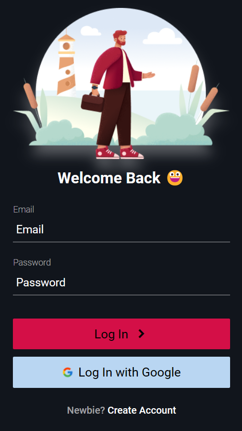
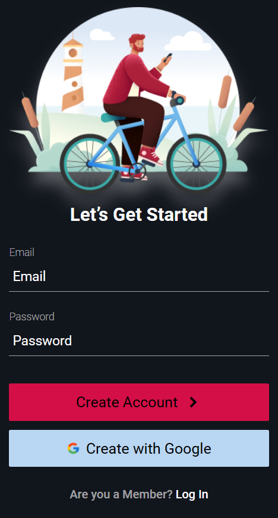

<h1>Login & Sign Up</h1>

<h5>Login e Sign Up com responsividade</h5>

<h4>Tecnologias usadas:</h4>

<h3>Link da aplicação <a href="https://lucasfgaldinos.github.io/login-signup/">aqui</a></h3>

  
  

